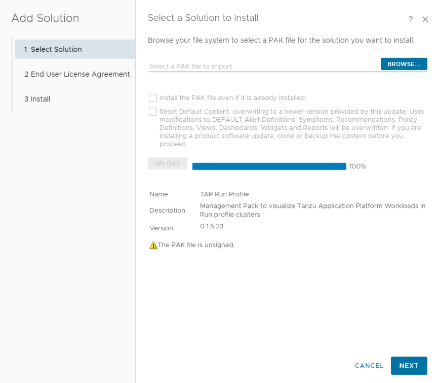
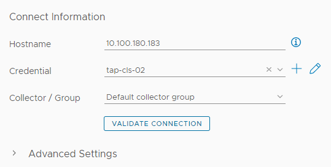

# TAP Monitoring With Aria Operations

## Pre Requisites
1. TAP installed on 1 or more clusters
2. Network access from Aria Operations to the kubernetes clusters where TAP is installed
3. Administrative rights in Aria Operations in order to install the management packs
4. Access to the TAP kubernetes clusters to create the needed RBAC
5. Access to TAP values in order to add needed overlay configuration

## Prepare TAP
The first step in preparing the clusters is to create a secret with the needed overlay in All clusters you will be monitoring that are configured with the Full, Build or Iterate profiles.

This overlay adds an additional annotation to deliverables with the workloads UID it was created from. This is needed as we want the management pack to be able to correlate between TAP resources across clusters and we need a single field which can definitively correlate between the relevant resources.

```bash
kubectl apply -f tap-aria-operations-overlay.yaml -n tap-install
```

We now need to add the refernece to this overlay in our TAP values by adding the following snippet:

```yaml
package_overlays:
- name: ootb-templates
  secrets:
  - name: ootb-templates-overlay-for-aria-operations
```

Now you need to update your TAP installation as you typically do, either via the CLI or using the GitOps model available since TAP 1.5.

## Prepare Kubernetes RBAC
In order for the the solution to work we need to create RBAC resources to give Aria Operations the needed permissions to visualize our workloads.  
The permissions needed are read only.
```bash
kubectl create sa -n tap-install aria-service-account

kubectl create clusterrolebinding aria-integration \
  --clusterrole=app-viewer \
  --serviceaccount=tap-install:aria-service-account

cat <<EOF | kubectl apply -f -
apiVersion: v1
kind: Secret
metadata:
  annotations:
    kubernetes.io/service-account.name: aria-service-account
  name: aria-service-account-token
  namespace: tap-install
type: kubernetes.io/service-account-token
EOF
```

We now need to retrieve the needed information for the integration which is the IP or FQDN of our clusters API server, as well as the token for our previously created service account:

```bash
echo "Cluster IP: $(kubectl config view --minify -o jsonpath='{.clusters[0].cluster.server}' | sed 's|https://||g' | sed 's|:.*||g')"

echo "SA Token: $(kubectl get secret aria-service-account-token -n tap-install -o jsonpath='{.data.token}' | base64 --decode)
```

## Installing the Management Packs
Due to how the Aria Operations Management Pack Builder works, and some of its current limitations, we have split the TAP monitoring into 2 seperate Management packs:
1. TAP - this is for any Build, Full and Iterate profile based clusters
2. TAP Run - this is for Run profile clusters

In any event, even if you are only using a single full or iterate cluster, you must add both management packs to Aria Operations in order for the provided dashboard to work as it references resources from both management packs.

We also need to install the management packs in the correct order (**TAP** first then **TAP Run**) in order for the dashboard to import and get configured correctly.

### Installing the TAP Management Pack
1. Login to Aria Operations 
2. Go to **Data Sources** > **Integrations** and then click on the **Repository** tab
3. Click the **add** button in order to add the management pack  

4. Select the Management Pack file from your filesystem and click **upload**

5. Click **next** once uploaded

6. Confirm the installation of an unsigned management pack  

7. Accept the EULA and click next

8. Once the management pack finishes installing click **finish**


## Installing the TAP Run Profile Management Pack
1. Login to Aria Operations 
2. Go to **Data Sources** > **Integrations** and then click on the **Repository** tab
3. Click the **add** button in order to add the management pack  

4. Select the Management Pack file from your filesystem and click **upload**

5. Click **next** once uploaded

6. Confirm the installation of an unsigned management pack  

7. Accept the EULA and click next

8. Once the management pack finishes installing click **finish**


## Configuring TAP Clusters in Aria Operations
Now that the management packs have been added, we can start adding our TAP clusters.

### Adding a Full, Iterate or Build cluster
1.  Login to Aria Operations 
2. Go to **Data Sources** > **Integrations** and then click on the **Repository** tab
3. Find the **TAP** Management Pack and click on **ADD ACCOUNT**  

4. Fill out the name of the cluster and the IP/FQDN of the kubernetes cluster  

5. Click the **+** symbol next to **credentials** and add a new credential where the name can be anything, and the value should be the token retrieved previously  

6. Validate the connection  


7. Add the cluster  


You can repeat this for as many Full, Build or Iterate clusters you want to connect.

### Adding a Run cluster
1.  Login to Aria Operations 
2. Go to **Data Sources** > **Integrations** and then click on the **Repository** tab
3. Find the **TAP Run Profile** Management Pack and click on **ADD ACCOUNT**  

4. Fill out the name of the cluster and the IP/FQDN of the kubernetes cluster  

5. Click the **+** symbol next to **credentials** and add a new credential where the name can be anything, and the value should be the token retrieved previously  

6. Validate the connection  


7. Add the cluster  


You can repeat this for as many Run clusters you want to connect.

## Viewing What Is Collected
**NOTE :** After adding an adapter instance to Aria Operations, you will need to wait a few minutes (5-10 minutes or so) untill the system collects all the data and starts visualizing the resources with populated data.

### Viewing all the object types collected
1. Go to **Environment** > **Object Browser** and then open the **All Objects** section and find the **TAP** section  

2. For Run profile clusters, the resources collected can be found under the **TAP Run Profile** section  


## Viewing the Provided Dashboard
As part of the management pack a Dashboard has been added giving a drill down approach from your workloads throughout the relevant resources till the running app itself.

### Finding the dashboard
Go to **Visualize** > **Dashboards** and then click on the **all** section and search for "**TAP Multi Cluster Workload Overview**"  


### What does the dashboard provide us
1. The dashboard starts by providing a list of workloads from all attached clusters and based on the one selected will show the relationship graph with other resources right bellow it  

2. We then can scroll down and see the Source Repository details of our workload as well as a list of Test runs. if you select a relevant test run, the details of that run will show on the right. Bellow this we see the Source Scan status, TBS image details, and a list of image builds which when one is selected will show us build information in the table bellow it.  

3. We then can scroll down and see the image scan details for our image and select the relevant config writer from the provided list in order to see its details on the right. We then bellow that have the list of all deliverables, accross all atached clusters, which are derived from this workload. When a deliverable is selected, the details of this deliverable is provided on the right hand table.  

4. Now we have the Relationship graph of the selected deliverable  

5. Finally we have a selection of the deliverable sources and provide data about the source, the kapp application used to install the app, and finally a list of the resources created by the deliverable with a metric/property picker and metric chart module to visualize the data of the relevant runtime resources.  


## Current limitations
1. Pagination is not handled yet. if you have more then 1000 workloads in a cluster, you will not see all resources.
2. The following TAP workload resources are not currently collected:
* Maven Artifact Source
* Kaniko Builds
* Service Bindings
* App SSO
* SCG + ACS
* API Descriptors
* Pod Intent
